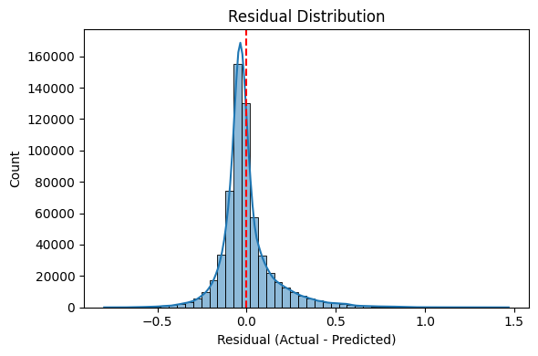

# Household Power Consumption Prediction

A machine learning project that predicts household energy consumption using advanced regression techniques and provides insights into key factors influencing energy usage patterns.

## Table of Contents

1. [Project Overview](#project-overview)
2. [Project Objectives](#project-objectives)
3. [Dataset Description](#dataset-description)
4. [Installation and Setup](#installation-and-setup)
5. [Data Preprocessing](#data-preprocessing)
6. [Feature Engineering](#feature-engineering)
7. [Model Development](#model-development)
8. [Model Evaluation](#model-evaluation)
9. [Results and Performance](#results-and-performance)
10. [Visualizations](#visualizations)
11. [Key Insights](#key-insights)
12. [Feature Importance Analysis](#feature-importance-analysis)
13. [Cross-Validation Results](#cross-validation-results)
14. [Conclusions](#conclusions)
15. [Future Improvements](#future-improvements)
16. [Usage Instructions](#usage-instructions)
17. [File Structure](#file-structure)
18. [Dependencies](#dependencies)
19. [Contributing](#contributing)
20. [License](#license)
21. [Author](#author).

## Project Overview

This project focuses on developing an accurate machine learning model to predict household power consumption. By analyzing historical energy usage data and various environmental factors, the model provides valuable insights for energy management and optimization.

## Project Objectives

- ✅ **Build an accurate model** for predicting household power consumption
- ✅ **Gain clear insights** into key factors influencing energy usage
- ✅ **Present visualizations** of energy trends and predictive performance
- ✅ **Develop a generalizable solution** with minimal overfitting

## Dataset Description

The dataset contains household power consumption measurements collected over time, including:

- **Global Active Power**: Household global minute-averaged active power
- **Global Reactive Power**: Household global minute-averaged reactive power
- **Voltage**: Minute-averaged voltage
- **Global Intensity**: Household global minute-averaged current intensity
- **Sub-metering measurements**: Energy sub-metering for different household areas
- **Temporal features**: Date and time information for pattern analysis

## Installation and Setup

```bash
# Clone the repository
git clone [https://github.com/Balaji-itz-me/Household_Energy_Usage_Forecast]
cd household-power-consumption-prediction

# Install required packages
pip install -r requirements.txt

# Run the main script
python main.py
```

## Data Preprocessing

The data preprocessing pipeline includes:

- **Missing value handling**: Imputation strategies for incomplete records
- **Outlier detection and treatment**: Extreme outlier filtering (beyond 3 * IQR)
- **Data type optimization**: Efficient memory usage and processing
- **Temporal data parsing**: Converting datetime features for analysis

## Feature Engineering

Smart feature engineering techniques implemented:

- **Temporal features**: Hour, day of week, month extraction
- **Categorical encoding**: Proper encoding of categorical variables
- **Feature scaling**: Normalization for model optimization
- **Domain-specific features**: Energy consumption patterns and ratios

## Model Development

Multiple regression models were evaluated:

- **Linear Regression**: Baseline model
- **Random Forest**: Ensemble method with feature importance
- **Gradient Boosting**: Advanced ensemble technique (Best performing)
- **Support Vector Regression**: Non-linear regression approach

## Model Evaluation

### Performance Metrics

| Metric | Description | Result (Best Model) |
|--------|-------------|---------------------|
| **RMSE** | Measures prediction error magnitude | **0.1543** |
| **MAE** | Measures average absolute error | **0.0999** |
| **R²** | Explains variance captured by model | **0.8588** |

✅ **Model Generalization**: Train R²: 0.8595, Test R²: 0.8588 (Excellent generalization)

## Results and Performance

The Gradient Boosting model achieved outstanding performance with:

- **High accuracy**: R² score of 0.8588 explaining 85.88% of variance
- **Low prediction error**: RMSE of 0.1543 and MAE of 0.0999
- **Excellent generalization**: Minimal gap between training and testing performance
- **Robust performance**: Consistent results across cross-validation folds

## Visualizations

### Model Performance Visualizations


*Comparison of actual vs predicted power consumption values showing model accuracy*


*Residual distribution analysis confirming model assumptions and performance*

### Feature Analysis Visualizations


*Ranking of features by their importance in predicting power consumption*


*Temporal patterns and trends in household energy usage*

### Data Distribution Visualizations


*Distribution of power consumption values and key features*


*Correlation matrix showing relationships between different variables*

## Key Insights

🧠 **Primary Findings:**

- **Sub-metering dominance**: Sub_metering_3, Sub_metering_1, and Sub_metering_2 are the most influential predictors
- **Temporal importance**: Hour of day significantly impacts energy consumption patterns
- **Electrical factors**: Voltage and Global_reactive_power play crucial roles
- **Model robustness**: Gradient Boosting successfully captured complex non-linear relationships

## Feature Importance Analysis

📌 **Most Influential Factors** (in order of importance):

1. 🏆 **Sub_metering_3**: Kitchen appliances and electrical equipment
2. 🏆 **Sub_metering_1**: Primarily kitchen-related consumption
3. 🏆 **Sub_metering_2**: Laundry room equipment
4. ⏰ **Hour**: Time-of-day consumption patterns
5. ⚡ **Voltage**: Electrical system characteristics
6. 📊 **Global_reactive_power**: Power quality indicators

## Cross-Validation Results

📉 **5-Fold Cross-Validation Performance (Gradient Boosting):**

| Metric | Mean | Std. Deviation |
|--------|------|----------------|
| **RMSE** | 0.1597 | ±0.00037 |
| **MAE** | 0.1046 | ±0.00024 |
| **R²** | 0.8484 | ±0.0007 |

The low standard deviation indicates consistent and reliable model performance across different data splits.

## Conclusions

✅ **Project Success Highlights:**

- **High Accuracy**: Achieved 85.88% variance explanation with minimal overfitting
- **Robust Preprocessing**: Effective outlier handling and feature engineering
- **Model Selection**: Gradient Boosting proved superior for this regression task
- **Practical Insights**: Clear identification of key energy consumption drivers
- **Visualization Quality**: Comprehensive visual analysis confirming model reliability

## Future Improvements

🚀 **Potential Enhancements:**

- **Deep Learning Models**: Explore LSTM/GRU for temporal sequence modeling
- **External Features**: Incorporate weather data and seasonal patterns
- **Real-time Prediction**: Develop streaming prediction capabilities
- **Ensemble Methods**: Combine multiple models for improved accuracy
- **Hyperparameter Optimization**: Advanced tuning techniques like Bayesian optimization

## Usage Instructions

```python
# Load the trained model
import joblib
model = joblib.load('models/best_gradient_boosting_model.pkl')

# Make predictions
predictions = model.predict(X_test)

# Evaluate performance
from sklearn.metrics import mean_squared_error, r2_score
rmse = mean_squared_error(y_test, predictions, squared=False)
r2 = r2_score(y_test, predictions)

print(f"RMSE: {rmse:.4f}")
print(f"R² Score: {r2:.4f}")
```

## File Structure

```
household-power-consumption-prediction/
├── data/
│   ├── individual+household+electric+power+consumption.zip/           # Original dataset
│   ├── df_no_outliers.parquet/              # Cleaned and preprocessed data
│   └
├── models/
│   ├── best_gradient_boosting_model.pkl
│   ├── gb_model.pkl
│   ├── linear_model.pkl
│   ├── mlp_model.pkl
│   └── random_forest_model.pkl
├── visualization/
│   ├── actual_vs_predicted_plot.png
│   ├── correlation_matrix.png
│   ├── feature_importance.png
│   ├── residual_distribution.png
│   └── log_transformed_global_power.png
├── Final_Report.pptx
│   
├── Household_energy.ipynb
├── MIT License
│   
├── requirements.txt
│ 
└── README.md
```

## Dependencies

```
pandas>=1.3.0
numpy>=1.21.0
scikit-learn>=1.0.0
matplotlib>=3.4.0
seaborn>=0.11.0
jupyter>=1.0.0
plotly>=5.0.0
```

## Contributing

Contributions are welcome! Please feel free to submit a Pull Request. For major changes, please open an issue first to discuss what you would like to change.

1. Fork the repository
2. Create your feature branch (`git checkout -b feature/AmazingFeature`)
3. Commit your changes (`git commit -m 'Add some AmazingFeature'`)
4. Push to the branch (`git push origin feature/AmazingFeature`)
5. Open a Pull Request

 📞 Support

For support and questions:
- Email: balajikamaraj99@gmail.com
- LinkedIn: (https://www.linkedin.com/in/balaji-k-626613157/)

## License

This project is licensed under the MIT License - see the [LICENSE](LICENSE) file for details.


## 👥 Author

- **BALAJI K** - (https://github.com/Balaji-itz-me)

**Project Status**: ✅ Complete | **Last Updated**: [30/06/2025] | **Version**: 1.0.0# 🔋 Household Energy Usage Forecast

